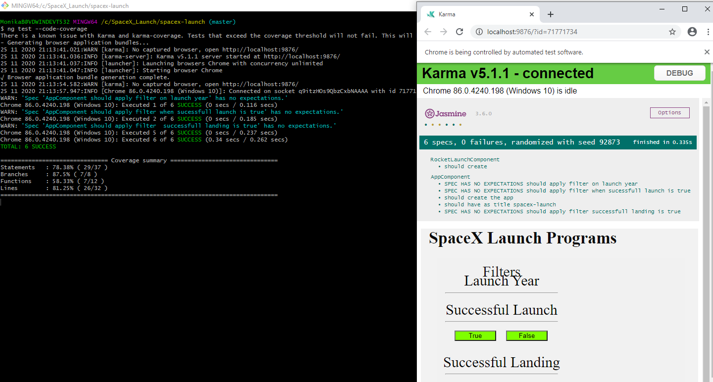
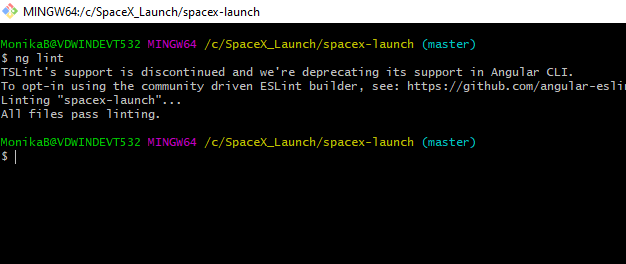

# SpaceX-Launch-Program

Develop a front-end application which would help users list and browse all launches by SpaceX Program

# Requirements

Download node.js with npm on your machine.

# Installation

$ npm install -g @angular/cli

$ ng new [project-name]

$ cd [project-name]

# Run Application and start development Server

Commands for Client Side rendering:

Angular Live Development Server is listening on localhost:4200, open your browser on http://localhost:4200/ 

$ ng serve

Commands for Server Side Rendering:

Node Express server listening on http://localhost:4000

$ ng add @nguniversal/express-engine

$ npm run build:ssr

$ npm run serve:ssr

# Run Tests

All unit tests are performed with jasmin and karma and can be configured in karma.conf.js. 

$ ng test

For Code Coverage

$ ng test --code-coverage

# Run Lint

Linting is the automated checking of your source code for programmatic and stylistic errors.

$ ng lint

# LightHouse Score for Performance, SEO , Accessibility and Best Practices

Score: 91

# Approach to develop this Angular Application

1. Once we serve the application then there will be root folder in which we have App Component, Module, Spec file, HTML and CSS file.

2. In app component we defined two sections , one is for filter options and other one is for displaying all rocket launches by SpaceX program.

3. Filter Options will be Launch year , Succesful Landing and Succesful Launch.

4. When we load the page for the first time , We are hitting GET API to fetch the data about all rocket launches by SpaceX program.

5. For Fetching the data, Created one service where we defined http call and return the data to app component.

6. Once will get the data in the component then we will display the data in web page through String Interpolation Binding.

7. We can also apply filters and applied filters shoulkd change the URL and update the data with the latest records without refreshing the web page.
   Based on the API call(By Passing parameters in API like launch_year, land_success etc.) will display the filtered data to the User.

8. Media Queries used to make the web page responsive so that layout won't impact on Mobile devices and Tablet.

9. Used Angular Universal for server side rendering so it will be SEO friendly and initial launch programs landing page has to be server side rendered.

10. Unit testing done for the components by writing test cases.

# Heroku Deployment using GitHub

1. Create Repository on Github and upload files

2. Create Account on Heroku

3. Click new and then Create New App

4. Provide App name and click on Create app button

5. Choose deployment method as Github

6. Once connected to Git Hub then look for you repository

7. Click on Connect then click on Enable Automatic Deploy

8. After this click on Deploy Branch

9. Once deployed click on View and it will redirect to the link where application is deployed

